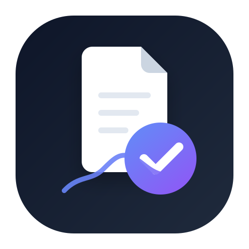

<p align="center">
  
</p>

<h1 align="center">ProofDesk AI</h1>

<p align="center">
  <strong>Turn Unstructured Documents into Actionable Tasks — Instantly</strong>
</p>

<p align="center">
  <a href="#features">Features</a> •
  <a href="#tech-stack">Tech Stack</a> •
  <a href="#getting-started">Getting Started</a> •
  <a href="#architecture">Architecture</a> •
  <a href="#contributing">Contributing</a> •
  <a href="#license">License</a>
</p>

---

## 🚀 What is ProofDesk AI?

**ProofDesk AI** is an AI-powered document processing tool that converts messy client communications — PDFs, images, screenshots, or pasted text — into **structured task lists** with deadlines, priorities, and **AI-generated professional draft replies**.

Built for **freelancers, consultants, and professionals** who need to quickly extract action items from chaotic client messages.

### The Problem
You receive a PDF with project changes, a screenshot of meeting notes, or a text message with multiple requests. Manually reading through and extracting tasks wastes valuable time.

### The Solution
Upload → AI extracts tasks → Get organized task list + draft reply. **In seconds, not hours.**

---

## ✨ Features

| Feature | Description |
|---------|-------------|
| 📄 **Multi-format Upload** | Process PDFs, images (PNG, JPG, WebP), or paste text directly |
| 🤖 **AI Task Extraction** | Automatically identifies action items with deadlines and priority levels |
| 📝 **Draft Reply Generation** | AI creates a professional response you can send immediately |
| ✅ **Task Management** | Toggle tasks between open/done with persistent state |
| 📊 **Document History** | Access all previously processed documents and their results |
| 🔐 **Secure Authentication** | Email/password authentication via Supabase |
| 📱 **Responsive Design** | Works seamlessly on desktop and mobile devices |
| ⚡ **Real-time Processing** | Animated step-by-step processing indicator |

---

## 🛠 Tech Stack

| Layer | Technology |
|-------|-----------|
| **Frontend** | React 18, TypeScript, Vite |
| **UI Components** | Radix UI, shadcn/ui, Tailwind CSS |
| **Animations** | Motion (Framer Motion), CSS Animations |
| **Routing** | React Router v7 |
| **Authentication** | Supabase Auth |
| **Database** | Supabase (PostgreSQL) |
| **File Storage** | Supabase Storage |
| **AI Processing** | OpenRouter API (GPT) |
| **Email Service** | Resend API |
| **SEO** | React Helmet Async, JSON-LD Structured Data |

---

## 📁 Project Structure

```
ProofDesk-AI/
├── public/                  # Static assets (favicon, logo, robots.txt, sitemap)
├── docs/                    # Documentation, PRD, requirements
├── src/
│   ├── components/
│   │   ├── common/          # Shared components (Logo, PageMeta, RouteGuard, SplashScreen)
│   │   ├── layouts/         # App layout with sidebar navigation
│   │   └── ui/              # shadcn/ui component library
│   ├── contexts/            # React context (AuthContext)
│   ├── db/                  # Supabase client configuration
│   ├── hooks/               # Custom React hooks
│   ├── lib/                 # Utility functions
│   ├── pages/               # Route page components
│   │   ├── LoginSignup.tsx
│   │   ├── ProfileCompletion.tsx
│   │   ├── Dashboard.tsx
│   │   ├── Processing.tsx
│   │   ├── Results.tsx
│   │   └── History.tsx
│   ├── types/               # TypeScript type definitions
│   ├── App.tsx              # Root app component with routing
│   ├── main.tsx             # Entry point
│   ├── routes.tsx           # Route configuration
│   └── index.css            # Global styles and design tokens
├── supabase/                # Supabase edge functions and config
├── index.html               # HTML entry with full SEO meta tags
├── vite.config.ts           # Vite configuration
├── tailwind.config.js       # Tailwind CSS configuration
├── tsconfig.json            # TypeScript configuration
└── package.json
```

---

## 🏁 Getting Started

### Prerequisites

- **Node.js** ≥ 18.x
- **pnpm** ≥ 8.x (recommended) or npm
- A **Supabase** project with the required schema

### Installation

```bash
# Clone the repository
git clone https://github.com/EklavyajhaAI07/ProofDesk-AI.git
cd ProofDesk-AI

# Install dependencies
pnpm install

# Create environment file
cp .env.example .env
# Edit .env with your Supabase and API credentials

# Start the development server
npx vite --port 5173
```

### Environment Variables

Create a `.env` file in the project root:

```env
VITE_SUPABASE_URL=your_supabase_project_url
VITE_SUPABASE_ANON_KEY=your_supabase_anon_key
VITE_GROQ_API_KEY=your_groq_api_key
VITE_RESEND_API_KEY=your_resend_api_key
```

> ⚠️ **Never commit your `.env` file.** It is excluded via `.gitignore`.

---

## 🏗 Architecture

```
User Upload → Supabase Storage → AI Processing (OpenRouter) → Task Extraction → Supabase DB → Results Display
                                                                                    ↓
                                                                            Email Notification (Resend)
```

### Application Flow

1. **Authentication** → User signs up / logs in via Supabase Auth
2. **Profile Completion** → Mandatory profile fields before access
3. **Document Upload** → PDF, image, or text input
4. **AI Processing** → Text extraction → OpenRouter AI → JSON response
5. **Results** → Summary + Task list + Draft reply
6. **History** → All past documents accessible

---

## 🔒 Security

- All API keys and credentials stored in `.env` (git-ignored)
- Supabase Row Level Security (RLS) for data isolation
- Rate limiting on AI processing requests
- Input sanitization to prevent prompt injection
- Secure authentication via Supabase Auth

---

## 🤝 Contributing

We welcome contributions! Please see [CONTRIBUTING.md](CONTRIBUTING.md) for guidelines.

---

## 📄 License

This project is licensed under the MIT License — see the [LICENSE](LICENSE) file for details.

---

## 🔗 Links

- **Repository**: [github.com/EklavyajhaAI07/ProofDesk-AI](https://github.com/EklavyajhaAI07/ProofDesk-AI)
- **Documentation**: [docs/PRD.md](docs/PRD.md)
- **Security Policy**: [SECURITY.md](SECURITY.md)

---

<p align="center">
  Made with ❤️ by the ProofDesk AI Team
</p>
